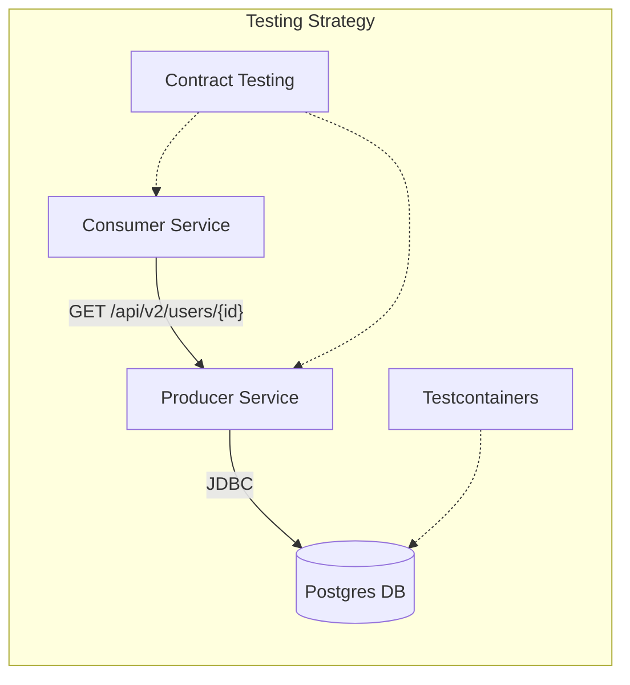

# Java Avanzado y API Versioning: Sistema de Usuarios

## Escenario

Este laboratorio simula un sistema de gestión de usuarios en una arquitectura de microservicios. Nos enfrentamos a desafíos comunes en sistemas evolutivos:

1. **Evolución del API**: Los consumidores necesitan nuevas funcionalidades, pero no podemos romper a los clientes antiguos.
2. **Integración Fiable**: Necesitamos garantizar que nuestro servicio (Productor) y sus clientes (Consumidores) se comunican correctamente antes de desplegar.
3. **Persistencia Real**: Las pruebas con bases de datos en memoria (H2) a veces ocultan errores específicos del motor real.

## 🎓 Laboratorio: API Versioning & Testing

### Objetivos de Aprendizaje

* Implementar y testear diferentes estrategias de **Versionado de API** (URL vs Header).
* Garantizar la estabilidad de la comunicación entre servicios mediante **Contract Testing** (Spring Cloud Contract).
* Configurar entornos de pruebas de integración robustos con **Docker** y **Testcontainers**.

### Ejercicios

La carpeta `docs/` contiene las guías paso a paso para cada ejercicio.

| # | Nombre del Ejercicio | Archivo de Test (Problema) | Documentación (Solución) |
|---|---|---|---|
| 1 | **Versionado de API** | [UserVersioningTest.java](multiple-api-versions/src/test/java/com/example/multipleapiversions/UserVersioningTest.java) | [Guía Ejercicio 1](docs/exercise-1-versioning.md) |
| 2 | **Contrato (Productor)** | [BaseTest.java](multiple-api-versions/src/test/java/com/example/multipleapiversions/BaseTest.java) | [Guía Ejercicio 2](docs/exercise-2-producer.md) |
| 3 | **Contrato (Consumidor)** | [UserContractTest.java](contract-consumer/src/test/java/com/example/contractconsumer/UserContractTest.java) | [Guía Ejercicio 3](docs/exercise-3-consumer.md) |
| 4 | **Persistencia (Postgres)** | [UserRepositoryTest.java](multiple-api-versions/src/test/java/com/example/multipleapiversions/UserRepositoryTest.java) | [Guía Ejercicio 4](docs/exercise-4-postgres.md) |

### Flujo de Trabajo

1. **Lee la documentación** del ejercicio correspondiente en la carpeta `docs/`.
2. **Abre el archivo** de test indicado (ver tabla arriba).
3. Busca los comentarios `// TODO:` y completa el código siguiendo la guía.
4. **Ejecuta el comando** de verificación para confirmar que tu solución funciona.

### Arquitectura



### Tecnologías

* **Java 17**
* **Spring Boot 3.x**
* **Spring Cloud Contract**: Para pruebas de contrato orientadas al consumidor.
* **Testcontainers**: Para pruebas de integración con bases de datos reales.
* **JUnit 5 & AssertJ**: Framework de testing y aserciones fluidas.
* **Maven**: Gestión de dependencias.

### Estructura del Proyecto

```
.
├── multiple-api-versions/          # (Productor) Servicio Principal
│   ├── src/main/java...            # Código fuente (Controladores, Entidades)
│   ├── src/test/resources/contracts # Definición de Contratos (Groovy)
│   └── src/test/java...            # Ejercicios 1, 2 y 4
├── contract-consumer/              # (Consumidor) Servicio Cliente simulado
│   └── src/test/java...            # Ejercicio 3
└── docs/                           # Guías paso a paso de los laboratorios
```

### Cómo Ejecutar

#### Prerrequisitos

* Java 17+ instalado.
* Maven instalado (o usar `./mvnw`).
* **Docker Desktop** corriendo (necesario para Testcontainers).

#### Comandos Útiles

**Compilar todo el proyecto:**

```bash
./mvnw clean install -DskipTests
```

**Levantar infraestructura manual (Opcional):**

```bash
cd multiple-api-versions
docker-compose up -d
```

### Solución de Problemas

| Error | Causa Probable | Solución |
|---|---|---|
| `Connection refused` (Testcontainers) | Docker no está corriendo | Inicia Docker Desktop. |
| `StubRunner` no encuentra stubs | No se instalaron los stubs | Ejecuta `mvn clean install` en el proyecto `multiple-api-versions` primero. |
| `UnsupportedOperationException` | No has completado el TODO | Implementa el código en el bloque `// TODO` o elimina la excepción. |

---
🎓 **Universidad Central de Venezuela - Laboratorio de Java Avanzado**
